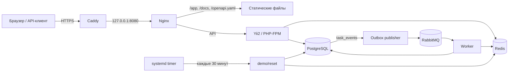

# Архитектура TaskPulse

TaskPulse — Yii2 API и Vue 3-интерфейс на одном домене. В production Caddy принимает HTTPS и проксирует запросы на Nginx, доступный только через loopback. Nginx отдаёт собранный интерфейс, Swagger UI и `openapi.yaml`; остальные маршруты передаёт PHP-FPM. PostgreSQL хранит пользователей, задачи, токены и события. Redis ускоряет аналитику, а RabbitMQ доставляет события фоновой обработке.

## Основной запрос

Контроллер загружает входные данные в Yii form model и проверяет их. Сервис выполняет действие, а ActiveRecord или репозиторий обращается к PostgreSQL. Список задач и аналитика используют SQL-файлы в соответствующих модулях. Автор задачи определяется текущим пользователем, а не `authorId` из тела запроса.

`users` одновременно являются учётными записями. API принимает Bearer-токен; в `auth_tokens` хранится только его SHA-256-хеш. Пользователь видит свой профиль, задачи и аналитику. Vue держит токен в памяти, поэтому после обновления страницы требуется повторный вход.

В публичном демо вход разрешён только фиксированному аккаунту. Регистрация и изменение профиля запрещены, но его задачи доступны для CRUD. `demo/reset` восстанавливает несколько примеров и удаляет созданные посетителями задачи только этого аккаунта; другие пользователи не затрагиваются. Таймер вызывает команду каждые 30 минут.

## Изменение задачи и событие

1. Сервис сохраняет изменение задачи и строку в `task_events` в одной транзакции PostgreSQL.
2. Publisher выбирает неопубликованные события, отправляет их в RabbitMQ и после подтверждения отмечает опубликованными.
3. Worker инвалидирует кеш аналитики в Redis. Таблица `processed_task_events` не даёт повторно обработать одно событие.
4. При сбое сообщение проходит retry-очередь с задержкой 5 секунд; после трёх повторов попадает в DLQ.

Сервис также инвалидирует кеш сразу после изменения задачи. Если Redis недоступен, аналитика рассчитывается из PostgreSQL; старое кешированное значение ограничено TTL в 300 секунд. PostgreSQL остаётся источником истины и для задач, и для ключей идемпотентности `POST /tasks`.

## Диагностика

`GET /health` проверяет PostgreSQL, Redis и RabbitMQ. Nginx и PHP пишут структурированные логи; `X-Request-Id` связывает ответ с записями. Тела запросов, токены, пароли и персональные значения в логи и Sentry не отправляются. Настройки запуска и ограничения публичного демо описаны в [deployment.md](deployment.md).
